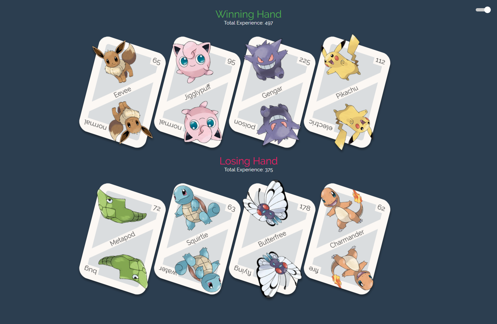

<h1 align="center">
    PokeDex
</h1>

<p align="center">
  
  
  <a href="https://www.linkedin.com/in/luiz-carlos-araujo-junior/">
    
  </a>
  
</p>

<p align="center">
  <a href="#project">Project</a>&nbsp;&nbsp;&nbsp;|&nbsp;&nbsp;&nbsp;
  <a href="#how-to-run">How to run</a>&nbsp;&nbsp;&nbsp;|&nbsp;&nbsp;&nbsp;
  <a href="#built-with">Built with</a>&nbsp;&nbsp;&nbsp;|&nbsp;&nbsp;&nbsp;
  <a href="#how-to-contribute">How to contribute</a>&nbsp;&nbsp;&nbsp;|&nbsp;&nbsp;&nbsp;
  <a href="#license">License</a>&nbsp;&nbsp;&nbsp;|&nbsp;&nbsp;&nbsp;
  <a href="#get-in-touch">Get in touch!</a>
</p>

## Project

A Pokedex game based on the Colt Steele course.
This game divides cards between 2 players and the one with the highest score is the winner

<h1 align="center">
    
</h1>

## How to run

#### Requirements

To clone and run the application you will need:

- [Git](https://git-scm.com)
- [Node](https://nodejs.org/)
- [Yarn](https://yarnpkg.com/)

From your command line:

```bash
# Clone this repository
$ git clone https://github.com/luiz-araujo/pokedex.git

# Go into the folder repository
$ cd pokedex

# Install dependencies
$ yarn install
```

### Fake API

First of all, so that you have the data to display on screen, a file was created that you can use as a fake API to provide you with this data.

The project has a dependency called json-server listed in package.json, and a file called server.json that contains the data for a route /pokemons.

```bash
# To run this server you can run the following command:
$ yarn json-server server.json -p 3333
```

### Game

After running the fake api open another terminal tab and start the game

```bash
# Run
$ yarn start

# running on port 3000
```

## Built With

- [ReactJS](https://reactjs.org/) - A JavaScript library for building user interfaces
- [TypeScript](https://www.typescriptlang.org/) - TypeScript is a typed superset of JavaScript that compiles to plain JavaScript, it provides better autocomplete and reduces the chance of errors by comparing with simple JavaScript
- [Styled Components](https://styled-components.com/) - Help keep the concerns of styling and element architecture separated and make components more readable.

## How to contribute

- Make a fork;
- Create a branch with your feature: `git checkout -b my-feature`;
- Commit changes: `git commit -m 'feat: My new feature'`;
- Make a push to your branch: `git push origin my-feature`.

After merging your receipt request to done, you can delete a branch from yours.

## License

This project is under the MIT license. See the [LICENSE](https://github.com/luiz-araujo/pokedex/blob/master/LICENSE) for details.

## Get in touch!

<a href="https://www.linkedin.com/in/luiz-carlos-araujo-junior/" target="_blank" >
  
</a>&nbsp;&nbsp;&nbsp;
<a href="mailto:luizcaj@yahoo.com.br" target="_blank" >
  
</a>

---

Made with ❤️ by Luiz Araújo.
